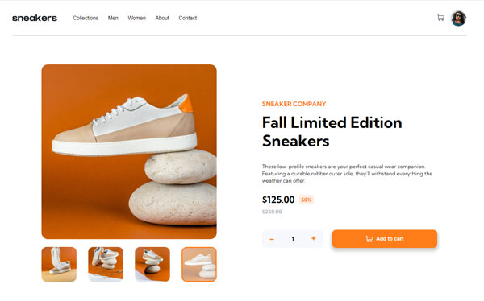

# Frontend Mentor - E-commerce product page solution

This is a solution to the [E-commerce product page challenge on Frontend Mentor](https://www.frontendmentor.io/challenges/ecommerce-product-page-UPsZ9MJp6). Frontend Mentor challenges help you improve your coding skills by building realistic projects.

## Table of contents

- [Overview](#overview)
  - [The challenge](#the-challenge)
  - [Screenshot](#screenshot)
  - [Links](#links)
- [My process](#my-process)
  - [Built with](#built-with)
- [Author](#author)
- [Acknowledgments](#acknowledgments)

## Overview

### The challenge

Users should be able to:

- View the optimal layout for the site depending on their device's screen size
- See hover states for all interactive elements on the page
- Open a lightbox gallery by clicking on the large product image
- Switch the large product image by clicking on the small thumbnail images
- Add items to the cart
- View the cart and remove items from it

### Screenshot
Desctop:

Mobile:

### Links

- Solution URL: [E-commerce product page](https://www.frontendmentor.io/challenges/ecommerce-product-page-UPsZ9MJp6/hub/ecommerce-product-page-i---xRuSl)
- Live Site URL: [https://skaneris.github.io/ecommerce-product-page/](https://skaneris.github.io/ecommerce-product-page/)

## My process

### Built with

- Semantic HTML5 markup
- CSS custom properties
- Flexbox
- Mobile-first workflow
- [VUE-3](https://vuejs.org/) - The Progressive JavaScript Framework
- [VUEX](https://vuex.vuejs.org/) - state management pattern + library for Vue.js applications
- [SASS](https://sass-lang.com/) - stylesheet language that’s compiled to CSS

## Author

- Frontend Mentor - [@Scaneris](https://www.frontendmentor.io/profile/Skaneris)
